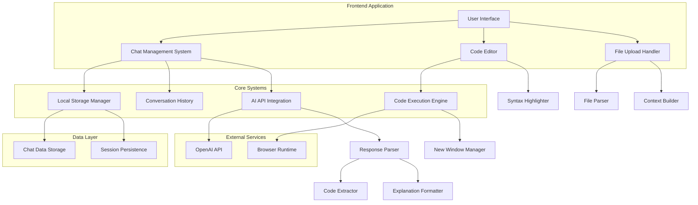

# AI-Powered JavaScript Code Generator

A sophisticated web application that combines artificial intelligence with an interactive development environment for JavaScript code generation, execution, and learning. This tool provides a comprehensive platform for developers to generate, test, and understand JavaScript code through natural language interactions.

## Key Features

### Conversational Code Generation
- **Multiple Chat Contexts**: Manage separate conversations for different projects and maintain context across sessions
- **Persistent Chat History**: All conversations are automatically saved locally with timestamps and full message history
- **Smart Sidebar Navigation**: Quick access to your most recent chat sessions with intuitive switching
- **Context-Aware AI**: The system maintains conversation context and builds upon previous interactions

### Advanced Code Development Environment
- **Natural Language Processing**: Describe your requirements in plain English to generate executable JavaScript code
- **Intelligent Code Generation**: Receive complete, production-ready JavaScript solutions with comprehensive explanations
- **Real-Time Code Execution**: Execute generated code instantly within the browser environment
- **Multi-Window Support**: Automatically detects page-modifying code and offers execution in separate windows

### File Integration and Context Management
- **Multi-Format File Upload**: Support for .txt, .js, .html, .css, .json, and .md files
- **Context Enhancement**: Uploaded files provide additional context for more accurate code generation
- **File-Based Learning**: AI analyzes uploaded code to provide targeted improvements and modifications

### Professional Development Tools
- **Comprehensive Error Handling**: Detailed error messages with stack traces for effective debugging
- **Console Output Capture**: All console.log statements and return values are captured and displayed
- **Syntax Highlighting**: Professional-grade code editor with language-specific highlighting
- **Responsive Design**: Optimized for both desktop and mobile development workflows

### User Experience and Interface
- **Theme Support**: Automatic dark/light mode detection with manual override capabilities
- **Clean Architecture**: Intuitive interface design focused on developer productivity
- **Session Management**: Automatic saving and restoration of work sessions
- **Bootstrap Integration**: Modern, responsive UI components for consistent user experience

## Architecture Overview



## Technology Stack

### Frontend Technologies
- **HTML5**: Semantic markup and modern web standards
- **CSS3**: Advanced styling with Bootstrap 5 framework integration
- **JavaScript (ES6+)**: Modern JavaScript features and modular architecture
- **Bootstrap 5**: Responsive UI framework for consistent design
- **Highlight.js**: Professional syntax highlighting for code display

### Integration and Services
- **OpenAI API**: Advanced language model integration for code generation
- **Local Storage API**: Client-side data persistence for chat history
- **File API**: Browser-based file upload and processing capabilities
- **Gramex UI Components**: Professional theme management system

### Development Architecture
- **Frontend-Only Design**: No backend dependencies, runs entirely in browser
- **Modular JavaScript**: Clean separation of concerns with organized code structure
- **Responsive Layout**: CSS Grid and Flexbox for optimal cross-device compatibility
- **Progressive Enhancement**: Graceful degradation for various browser capabilities

## Installation and Setup

### Quick Start
```bash
# Clone the repository
git clone https://github.com/prudhvi1709/jscodegen.git

# Navigate to project directory
cd jscodegen

# Serve the application using one of these methods:

# Option 1: Python HTTP Server
python3 -m http.server 8000

# Option 2: Node.js HTTP Server
npx http-server

# Option 3: Direct browser access
open index.html
```

### System Requirements
- Modern web browser with ES6+ support
- Internet connectivity for AI API access
- No additional build tools or dependencies required
- Minimum 1GB RAM for optimal performance

## Usage Guide

### Getting Started
1. **Application Launch**: Open the application in your browser at `http://localhost:8000`
2. **Chat Creation**: Click "New" in the sidebar to initiate a fresh conversation
3. **Code Generation**: Enter natural language descriptions of your programming requirements
4. **Code Review**: Examine the generated explanation and JavaScript code
5. **Code Execution**: Click "Run Code" to execute and test the generated solution

### Advanced Functionality

#### Chat Session Management
- **New Conversations**: Create isolated chat contexts for different projects
- **Session Switching**: Navigate between multiple active conversations
- **History Preservation**: All conversations are automatically saved with timestamps
- **Context Continuity**: AI maintains awareness of previous interactions within each session

#### File Integration Workflow
- **File Upload**: Use the paperclip icon to upload relevant code files
- **Context Integration**: Uploaded files automatically enhance AI understanding
- **Multi-File Support**: Handle multiple file types for comprehensive project context
- **Code Analysis**: AI analyzes existing code structure for targeted improvements

#### Code Execution Environment
- **In-Browser Execution**: Standard JavaScript runs directly in the current page
- **Isolated Execution**: DOM-modifying code automatically opens in new windows
- **Output Capture**: Console logs, return values, and errors are comprehensively displayed
- **Error Diagnostics**: Detailed error reporting with stack traces for debugging

### Common Use Cases
- **Algorithm Development**: Generate and test sorting, searching, and data structure algorithms
- **Web Component Creation**: Build reusable UI components with modern JavaScript
- **API Integration**: Create code for REST API consumption and data handling
- **Form Validation**: Develop comprehensive form validation and processing logic
- **DOM Manipulation**: Generate code for dynamic web page interactions
- **Data Processing**: Create functions for data transformation and analysis

## Browser Compatibility

| Browser | Minimum Version | Status |
|---------|----------------|--------|
| Chrome | 80+ | Fully Supported |
| Firefox | 75+ | Fully Supported |
| Safari | 13+ | Fully Supported |
| Edge | 80+ | Fully Supported |

## Technical Implementation

### Core Architecture Principles
- **Client-Side Architecture**: Complete functionality without server dependencies
- **Modular Design**: Separation of concerns with well-defined component boundaries
- **Responsive Implementation**: Adaptive layouts for various screen sizes and devices
- **Data Persistence**: Local storage for session continuity without external databases

### API Integration Details
- **OpenAI Compatible Endpoints**: Standard API integration with fallback mechanisms
- **Error Recovery**: Robust error handling with automatic retry capabilities
- **Rate Limiting**: Built-in protections against API abuse and quota management
- **Response Processing**: Intelligent parsing of AI responses for code extraction

### Performance Considerations
- **Lazy Loading**: Components loaded on demand for optimal startup performance
- **Memory Management**: Efficient handling of chat history and file uploads
- **Storage Optimization**: Compressed data storage for improved browser performance
- **Network Efficiency**: Optimized API calls with request batching capabilities

## Contributing

### Development Guidelines
- Use modern JavaScript (ES6+) features and syntax
- Follow existing code formatting and style conventions
- Implement comprehensive error handling for all new features
- Test functionality across supported browsers and devices
- Document complex logic with clear, concise comments

### Contribution Process
```bash
# Fork the repository on GitHub
git clone https://github.com/yourusername/jscodegen.git
cd jscodegen

# Create a feature branch
git checkout -b feature/your-feature-name

# Implement changes with appropriate testing
# Submit pull request with detailed description
```

### Types of Contributions
- **Bug Reports**: Detailed issue descriptions with reproduction steps
- **Feature Requests**: Well-defined enhancement proposals with use cases
- **Code Contributions**: Pull requests with fixes, improvements, or new features
- **Documentation**: Updates to user guides, technical documentation, and examples

## License

This project is licensed under the MIT License. See the [LICENSE](LICENSE) file for complete terms and conditions.

## Credits and Acknowledgments

**Primary Development**: [Gramener](https://gramener.com/)  
**Project Focus**: AI-powered development tool innovation  
**Technical Foundation**: Modern web technologies and AI integration  

### Technology Acknowledgments
- OpenAI for advanced language model capabilities
- Bootstrap team for comprehensive UI framework
- Highlight.js community for syntax highlighting solutions
- Open source community for foundational web technologies

## Support and Community

- **Issue Tracking**: [GitHub Issues](https://github.com/prudhvi1709/jscodegen/issues)
- **Community Discussion**: [GitHub Discussions](https://github.com/prudhvi1709/jscodegen/discussions)
- **Project Updates**: Follow repository for latest developments

---

**Professional AI-powered development tool for the JavaScript community**